# Dokumentacja

## 1. Diagram ERD

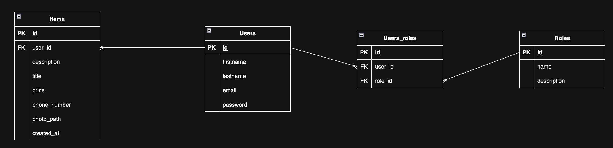

_Link do pliku (drawio): https://drive.google.com/file/d/1ysdqVV394UtxE319yc_0wSo8_fpxgLD1/view?usp=sharing_

## 2. Screeny aplikacji

### 2.1 Rejestracja

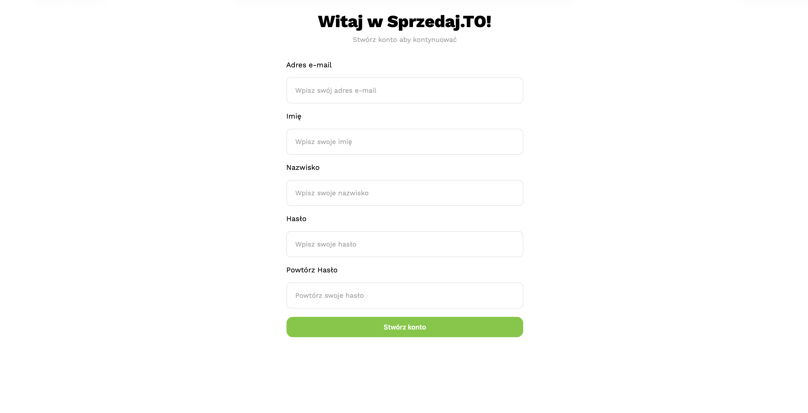

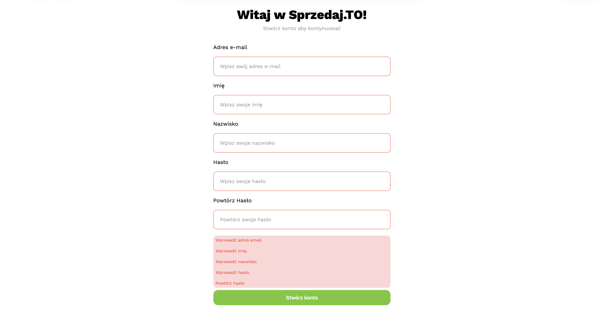

### 2.2 Logowanie

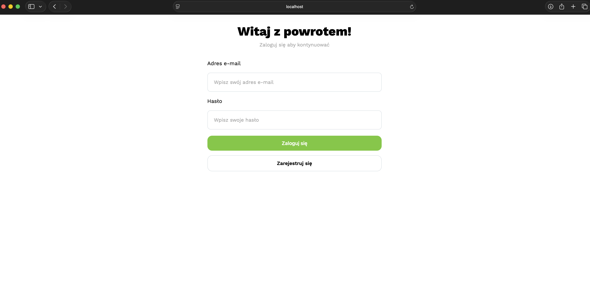

### 2.3 Strona główna

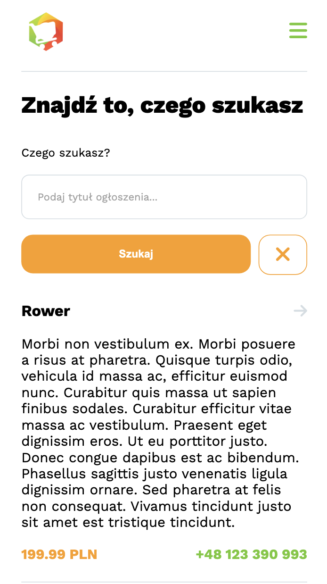

### 2.5 Formularz ogłoszenia

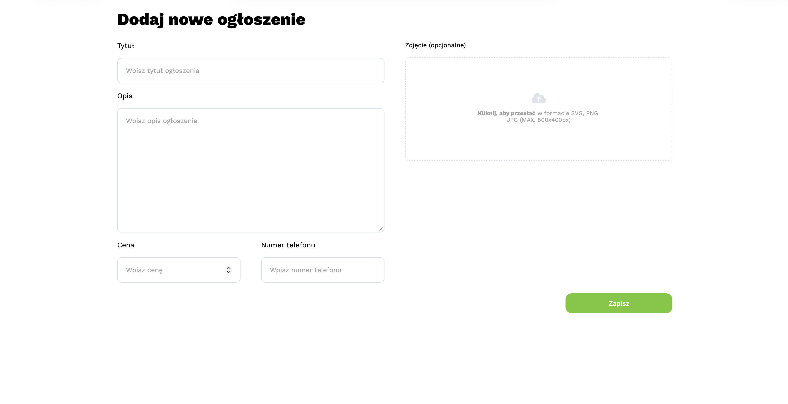

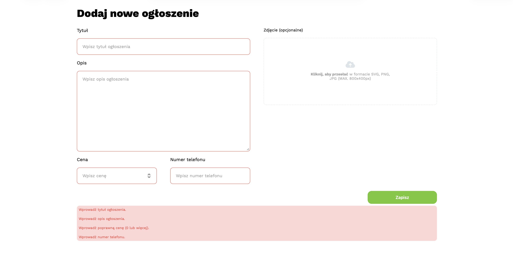

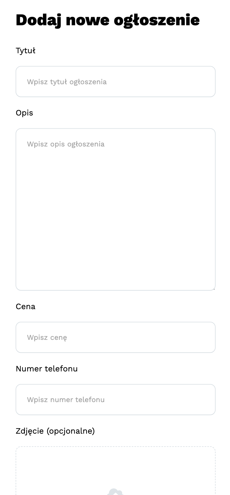

### 2.6 Strona użytkownika

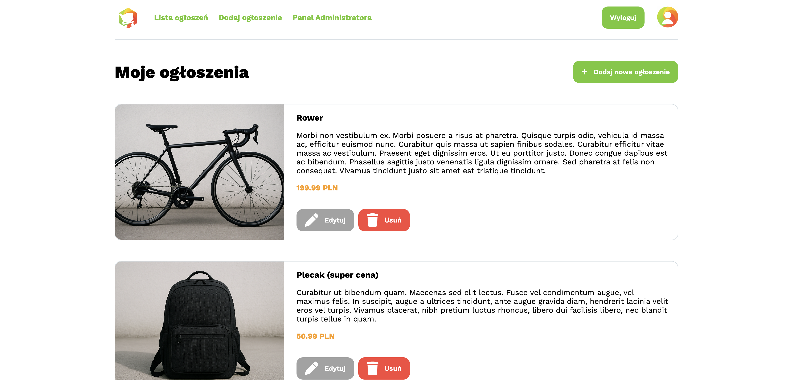

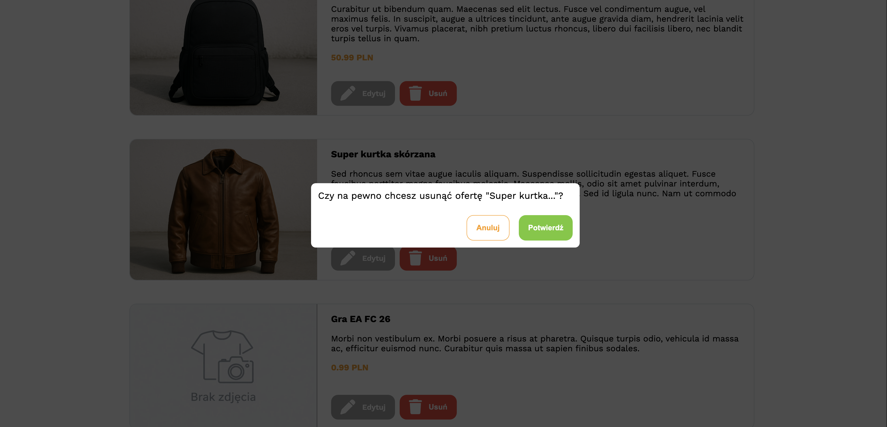

### 2.7 Edytowanie ogłoszenia

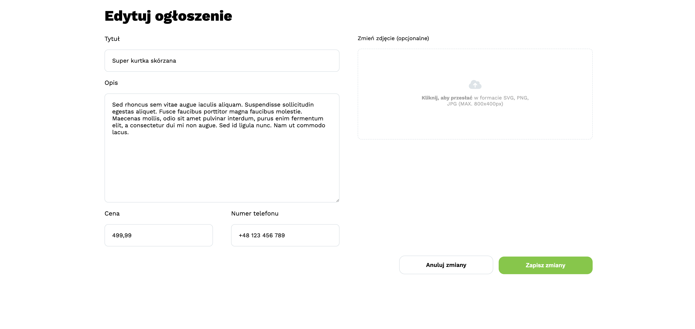

### 2.8 Panel administratora

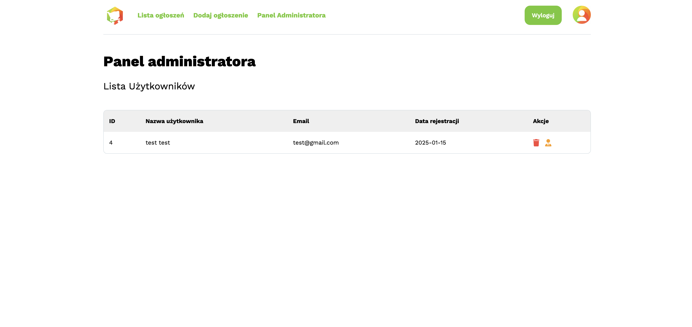

### 2.9 Nawigacja mobilna

### 2.10 Strona przedmiotu

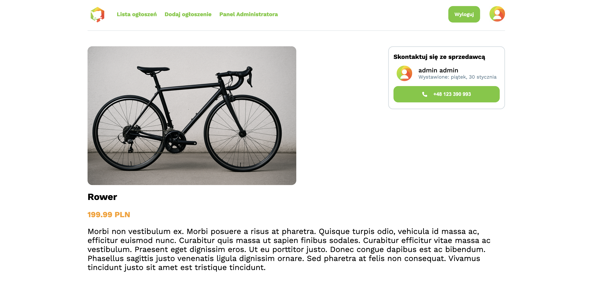

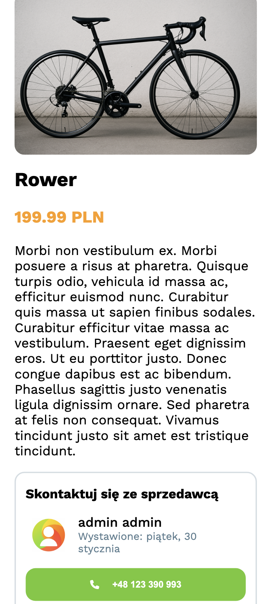

## 3. Diagram architektury

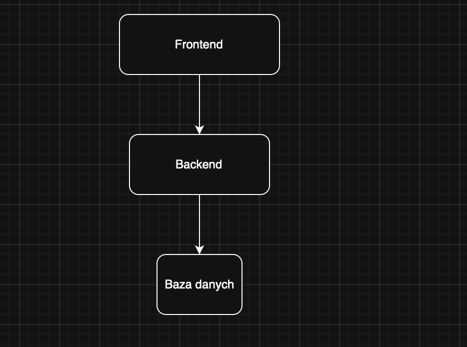
