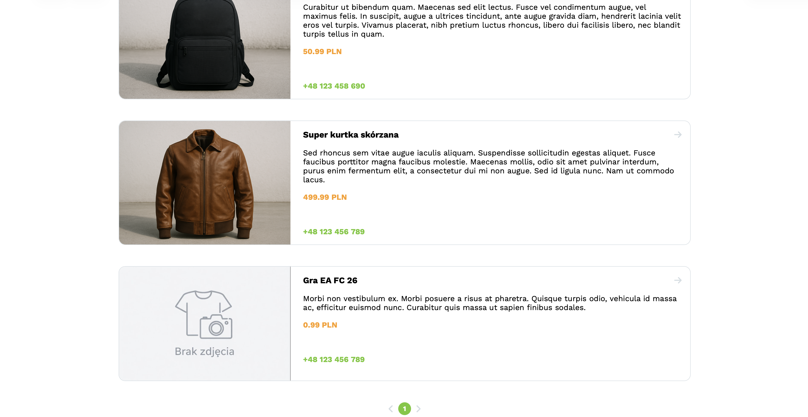

# Dokumentacja

## 1. Diagram ERD

_Link do pliku (drawio): https://drive.google.com/file/d/1ysdqVV394UtxE319yc_0wSo8_fpxgLD1/view?usp=sharing_

## 2. Screeny aplikacji

### 2.1 Rejestracja

### 2.2 Logowanie

### 2.3 Strona główna

### 2.5 Formularz ogłoszenia

### 2.6 Strona użytkownika

### 2.7 Edytowanie ogłoszenia

### 2.8 Panel administratora

### 2.9 Nawigacja mobilna

### 2.10 Strona przedmiotu

## 3. Diagram architektury

## 4. Instrukcja uruchomienia

W folderze gdzie znajduje się plik docker-compose.yml wywołujemy komendę docker compose up -d. Pozwala to na uruchomienie konterenerów z zależnościami aplikacji.

## 5. Scenariusz testowy

### 5.1 Logowanie

**Nazwa**: Logowanie do aplikacji  
**Cel**: Sprawdzenie czy użytkownik może zalogować się do konta podając email oraz hasło  
**Warunki wstępne**: Użytkownik wcześniej już zarejestrował się do aplikacji

**Kroki**:

1. Otwórz stronę logowania: http://localhost:8080/login
2. Wprowadź poprawny adres email
3. Wprowadź poprawne hasło
4. Wybierz opcję zaloguj się

**Rezultat**:

- Użytkownik zostaje zalogowany do swojego konta i jest przekierowany na stronę swojego profilu: http://localhost:8080/user-page
- Utworzona zostanie sesja użytkownika do której zostały dodane nowe właściwości

### 5.2 Logowanie z niepoprawnym formatem adresu email

**Nazwa**: Logowanie do aplikacji przy użyciu niepoprawnego formatu adresu email 
**Cel**: Sprawdzenie czy użytkownik może zalogować się do konta podając zły format email  
**Warunki wstępne**: Brak

**Kroki**:

1. Otwórz stronę logowania: http://localhost:8080/login
2. Wprowadź adres email: test@
3. Wprowadź poprawne hasło
4. Wybierz opcję zaloguj się

**Rezultat**:

- Formularz nie zostanie wysłany
- Wyświeltony zostanie komunikat o treści: "Wprowadź poprawny adres email"

### 5.3 Logowanie do konta przy użyciu nieprawidłowych danych do konta

**Nazwa**: Logowanie do aplikacji przy użyciu nieprawidłowych danych do kontal 
**Cel**: Sprawdzenie czy system nie daje jednoznacznej informacji czy użytkownik o podanym adresie email istnieje już w bazie danych  
**Warunki wstępne**: Brak

**Kroki**:

1. Otwórz stronę logowania: http://localhost:8080/login
2. Wprowadź adres email: test@gmail.com
3. Wprowadź losowe hasło
4. Wybierz opcję zaloguj się

**Rezultat**:

- Wyświeltony zostanie komunikat o treści: "Email lub hasło niepoprawne."

### 5.4 Rejestracja

**Nazwa**: Rejestracja do konta 
**Cel**: Sprawdzenie czy aplikacja umożliwia zakładanie nowych kont  
**Warunki wstępne**: Brak

**Kroki**:

1. Otwórz stronę rejestracji: http://localhost:8080/register
2. Wprowadź adres email: test@gmail.com
3. Wprowadź hasło
4. Wprowadź ponownie hasło do pola "Powtórz hasło"
5. Wprowadź imię użytkownika
6. Wprowadź nazwisko użytkownika
7. Wybierz opcję stwórz konto

**Rezultat**:

- Użytkownik zostanie przekierowany na stronę logowania
- Dane użytkownika zostaną zapisane w tabeli
- Wyświeltony zostanie komunikat o treści: "Utworzono nowe konto, zaloguj się!"

### 5.5 Rola Administratora

**Nazwa**: Wyświetlanie panelu administratora  
**Cel**: Sprawdzenie czy w momencie posiada roli administratora zostanie poprawnie wyświetlony jego panel  
**Warunki wstępne**: Użytkownik musi posiadać rolę administratora

**Kroki**:

1. Otwórz stronę panelu administratora: http://localhost:8080/admin

**Rezultat**:

- Użytkownikowi wyświetli się panel administratora

### 5.6 Błąd 403 (Panel Administratora)

**Nazwa**: Wyświetlenie błędu 
**Cel**: Sprawdzenie czy w momencie braku roli administratora użytkownik zostanie przekierowany na stronę błędu 403  
**Warunki wstępne**: Użytkownik nie posiada roli administratora

**Kroki**:

1. Otwórz stronę panelu administratora: http://localhost:8080/admin

**Rezultat**:

- Użytkownikowi wyświetli się strona błędu 403

### 5.7 Błąd 401 (Panel użytkownika)

**Nazwa**: Wyświetlenie błędu 
**Cel**: Sprawdzenie czy niezalogowany użytkownik zostanie przekierowany na strone błędu w momencie próbu wejścia na stronę profilu użytkownika 
**Warunki wstępne**: Użytkownik nie jest zalogowany

**Kroki**:

1. Otwórz stronę profilu użytkownika: http://localhost:8080/user-page

**Rezultat**:

- Użytkownikowi wyświetli się strona błędu 401

### 5.8 Tworzenie nowego ogłoszenia

**Nazwa**: Tworzenie nowego ogłoszenia  
**Cel**: Sprawdzenie czy zalogowany użytkownik może dodać nowe ogłoszenie 
**Warunki wstępne**: Użytkownik posiada konto w aplikacji oraz jest do niego zalogowany

**Kroki**:

1. Otwórz stronę formularzu: http://localhost:8080/add-offer
2. Wypełnij formularz
3. Wybierz opcję zapisz

**Rezultat**:

- Ogłoszenie zostanie zapisane w bazie
- Użytkownik zostanie przekierowany na stronę profilu

### 5.9 Wyświetlanie zgłoszeń użytkownika

**Nazwa**: Wyświetlanie zgłoszeń użytkownika  
**Cel**: Sprawdzenie czy zalogowany użytkownik może zobaczyć ogłoszenia na swoim profilu 
**Warunki wstępne**: Użytkownik posiada konto w aplikacji, jest do niego zalogowany oraz posiada już wcześniej utworzone ogłoszenia

**Kroki**:

1. Otwórz stronę profilu: http://localhost:8080/user-page

**Rezultat**:

- Użytkownikowi zostaną wyświetlone jego ogłoszenia

### 5.10 Aktualizowanie zgłoszeń

**Nazwa**: Aktualizowanie zgłoszeń użytkownika  
**Cel**: Sprawdzenie czy zalogowany użytkownik może aktualizować treść ogłoszenia 
**Warunki wstępne**: Użytkownik posiada konto w aplikacji, jest do niego zalogowany oraz posiada już wcześniej utworzone ogłoszenia

**Kroki**:

1. Otwórz stronę profilu: http://localhost:8080/user-page
2. Wybierz przycisk "Edytuj" przy wybranym ogłoszeniu
3. Wprowadź nową treść do wybranego pola.
4. Wybierz przycisk "Zapisz zmiany"

**Rezultat**:

- Treść wybranego ogłoszenia zostanie zaaktualizowana
- Użytkownik zostanie przekierowany na swój profil

### 5.11 Usuwanie zgłoszeń

**Nazwa**: Usuwanie zgłoszeń użytkownika  
**Cel**: Sprawdzenie czy zalogowany użytkownik może usunąć ogłoszenie 
**Warunki wstępne**: Użytkownik posiada konto w aplikacji, jest do niego zalogowany oraz posiada już wcześniej utworzone ogłoszenia

**Kroki**:

1. Otwórz stronę profilu: http://localhost:8080/user-page
2. Wybierz przycisk "Usuń" przy wybranym ogłoszeniu
3. Potwierdź operację w modalu.

**Rezultat**:

- Wybrane ogłoszenie zostanie usunięte z bazy danych
- Ogłoszenie przestanie być wyświetlane na profilu użytkownika

### 6. Zrealizowane funkcjonalności

- Tworzenie nowego konta - proces rejestracji
- Logowanie do konta wraz z utworzeniem sesji
- Filtrowanie ogłoszeń po tytule na stronie głównej
- Paginacja na stronie głównej
- Dodawanie nowych ogłoszeń, wraz z ich usuwaniem oraz edycją
- Panel administratora -> podział na rolę: użytkownik oraz administrator
- Profil użytkownika
- Pełna responsywność
- Wykorzystanie FETCH API do pobierania oraz usuwania ogłoszeń i użytkowników
- Użycie Loading Indicatora przy pobieraniu ogłoszeń
- Wykonane bingo bezpieczeństwa (oprócz A4, C3, E1, E5)
